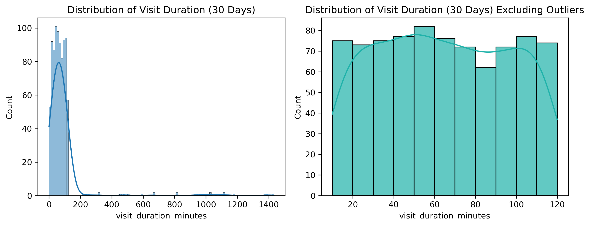
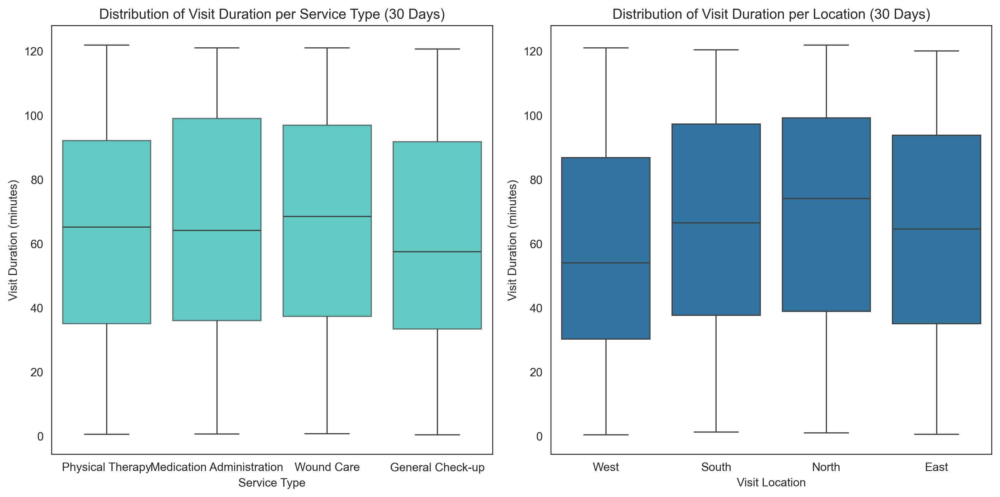
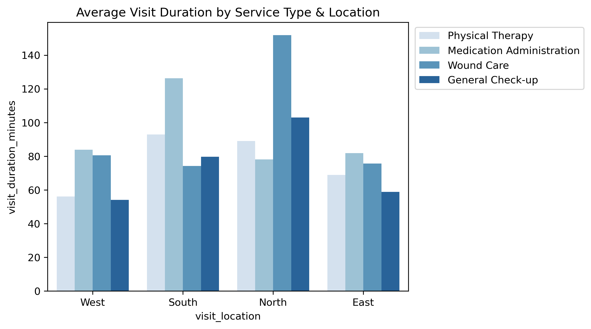
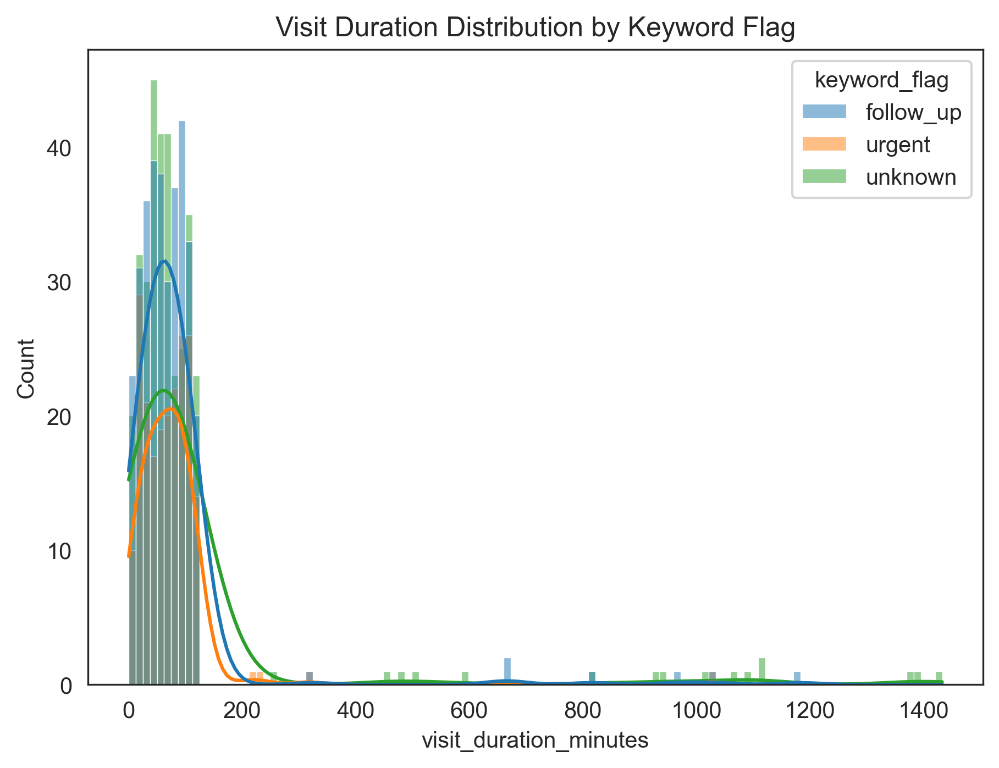

# LittleSteps Analysis

## Overview

This project experiments with **data analysis** in Python (via Jupyter Notebooks) using synthetic home care data from the last 30 days, simulating a home care service provider platform.

**Dataset size**  

- Original: 1,000 rows × 8 columns  
- After cleaning: 970 rows × 13 columns  
- Five new columns were created to:  

  1. Flag missing values in nurse notes  
  2. Flag missing values in visit end time  
  3. Classify keywords  
  4. Compute visit duration (based on start and end times)  
  5. Mark outliers in `visit_end_time` for quality checks    


## Repository Structure 

It stores:

- `data/` Raw CSV file (`visits.csv`)
- `notebooks/` Jupyter notebooks: `01_create.ipynb`for generating dataset and '02_EDA.ipynb' for analysis and visualisation
- `results/` Output charts (boxplots, histograms, etc.)
- `README.md` Project documentation
- `requirements.txt` Required third-party package


## Installation

###  Clone the repository:

```bash

git clone https://github.com/lsrgc/LittleSteps.git
cd LittleSteps
```

### Make sure Python 3.9+ is installed:  

```bash
python --version
```

### Install the required libraries:

```bash
pip install -r requirements.txt
```


## Dataset Overview

The dataset contains **970 visit records** with 13 columns:

| Column Name              | Type            | Non-Null Count | Description                                                                  |
| ------------------------ | --------------- | -------------- | ---------------------------------------------------------------------------- |
| `visit_id`               | object          | 970            | Unique identifier for each visit.                                            |
| `patient_id`             | object          | 970            | Unique identifier for each patient.                                          |
| `nurse_id`               | object          | 970            | Unique identifier for the attending nurse.                                   |
| `visit_start_time`       | datetime64\[ns] | 970            | Timestamp when the visit started.                                            |
| `visit_end_time`         | datetime64\[ns] | 875            | Timestamp when the visit ended (may be missing for some records).            |
| `service_type`           | object          | 970            | Type of service (e.g., Wound Care, General Check-up).                        |
| `visit_location`         | object          | 970            | Location of the visit (North, South, East, West).                            |
| `nurse_notes`            | object          | 970            | Free-text notes from the nurse (may contain errors, missing values, noise).  |
| `nurse_notes_missing`    | int32           | 970            | Flag (1/0) indicating if nurse notes were missing.                           |
| `missing_end_time`       | int32           | 970            | Flag (1/0) indicating if `visit_end_time` was missing.                       |
| `duration_outlier`       | int32           | 970            | Flag (1/0) for unusually short (<10min) or long (>2hr) visits.               |
| `keyword_flag`           | object          | 970            | Flagging based on presence of certain keywords (urgent, follow-up, etc.).    |
| `visit_duration_minutes` | float64         | 875            | Calculated visit duration in minutes. Missing where `visit_end_time` is NaN. |


## Data Quality & Cleaning

### Duplicate Visit IDs
- One duplicate `visit_id` was removed.  
- The duplicate was artificially generated via `uuid`; in practice, real-world duplicate visit IDs would need further investigation.  

### Multiple Visits
- Patients and nurses may have multiple visits.  
- **Most visited patient:** `P29486` (8 visits, majority have 1–3).  
- **Busiest nurse:** `N2273` (19 home visits).  

### Missingness
- **`visit_end_time`:** Missing in 95 rows (~10%).  
  - Imputation tested using the median.  
  - **t-test:** not reliable due to non-normality.  
  - **Mann–Whitney U-test:** no change in central tendency.  
  - **KS-test:** detected distributional shape change.  
  - **Decision:** Keep values missing, flagged under `missing_end_time`.  

- **`visit_duration_minutes`:** Missing for the same 95 rows.  
- **`nurse_notes`:** Missing values filled with `"NA"` and flagged under `nurse_notes_missing`.  

### Outliers
- `visit_end_time` outliers were injected to simulate “dirty” data to simulate realistic errors for testing.  

### Standardisation
- Inconsistent date/time formats reinstated.  
- Typos in `service_type` and `visit_location` corrected using regex.  


## Analysis Results

- **Average visit duration:** 86 minutes
From the charts below, we can see that the median is around 65 minutes, the mean (average) is close to 90 minutes, and the interquartile range (IQR) is approximately 40–95 minutes, where the majority of visits fall.
To make the boxplot easier to interpret, we used a log scale for visit duration; otherwise, the box would be heavily compressed due to extreme values.




 
- **By service type:**  
  - *Shortest:* General Check-up (75 minutes)  
  - *Longest:* Wound Care (101 minutes)  
  - ANOVA p-value = **0.0136**: significant differences across services.  


- **By location zone:**  
  - North visits longer than East by +37 minutes.  
  - North visits longer than West by +40 minutes.  







- **Top 3 nurses (longest average durations):** `N6025`, `N2009`, `N5590`  
- **Bottom 3 nurses (shortest average durations):** `N2459`, `N4605`, `N4754`  

The majority of patients had between 1 and 3 visits during the 30-day period while most of the nurses carried out about 10 home visits each in the last 30 days.


<p float="left">
  
  
</p>

### Notes on Urgency/ Follow-Up

- Assumed that **keywords** (e.g., “in pain”, “restless”) are generated from patient feedback.  
- Probability of each outcome:  
  - Urgency keyword triggered: **24%**  
  - Normal visit:**40%**  
  - Follow-up visit: **36%**  
- Urgency visits tend to have the **shortest average duration**, followed by follow-up visits.  
- Current model does not rank urgency levels.  
- Future improvements could incorporate **patient age, history, and service type** to refine urgency detection. 



